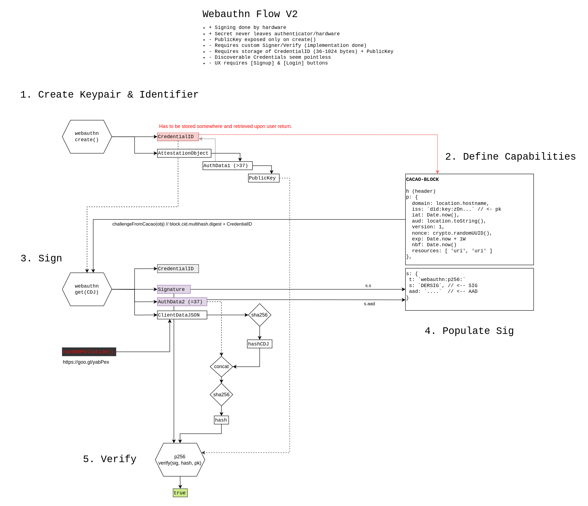
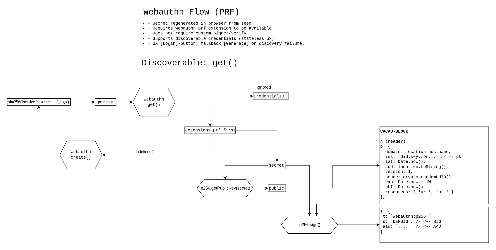

# key-webauthn

This package attempts to provide [passkey](https://passkey.org) support.

## Journey &amp; Caveats

### `Iteration 0`
The naive approach was to create a key-credential and use  
`navigator.credentials.get()` to generate signatures for cacao blocks.

This works.. But the `PublicKey` is provided only once during `navigator.credentials.create()`.  
This causes two issues:
1. Using _discoverable_ `get()` will use an unknown secret and produces unverifiable signatures.
2. `CredentialID` must be provided to the sign request to ensure the use of a specific key.

Effectively this means that `CredentialID` and `PublicKey` must be stored.

#### Results: `mixed`


We've successfully decoded `AttestationObject` and extracted the `PublicKey`
But webauthn was designed for Web2 environments.  
As such using on-chip/internal keys requires a central database
to provide a map between `Username` and (`CredentialID`, `PublicKey`) tuples.

---

### `Iteration 1`

We searched for alternatives not that do not require access to a central namespace.

**PRF extension**
The "Pseudo Random Function" extension described in [W3C Spec](https://w3c.github.io/webauthn/#prf-extension) can be used to deterministically generate the same secret given same RelayingParty
and same user-chosen KeyCredential.
- [PRF Example](https://github.com/oddsdk/passkeys/blob/main/packages/odd-passkeys/src/auth.js)


**Tradeoffs**

The tradeoff with PRF is that it uses "external" secrets relying on the browser's secure context.  
This is no different from using browser-extension based wallets.  
However not using hardware signing for users who posses secure hardware tags.. it's bit of a dissapointment.  
A benefit is that the choice of algorithm restriction is lifted, this removes some complexity
from the node-end as they nolonger are required to implement a custom signature verification method. (See diagram above)

**Compatibility**

The support for this extension is not complete; See [chart](https://github.com/oddsdk/passkeys/issues/13)

After discussions we identified two fallbacks in the absence of PRF support:

1. Use [Large Blob extension](https://w3c.github.io/webauthn/#sctn-large-blob-extension) to store a randomly generated secret for later retrevial on user return.
2. Provide fixed input to signing request and treat signature as external-secret. (This depends on the availability of a FIDO2/algorithm that does not use a random component in order to produce a deterministic result.)


---

### `Iteration 2`

Explore PRF support

---

#### Results: `negative`
PRF Support seems to be missing on Yubikey+Chrom\[e|ium\]+\[Linux|Windows\]
Confirmed via [Test Bench#prf-section](https://heavy-mint.surge.sh) and
 [3rd-party testbench](https://levischuck.com/blog/2023-02-prf-webauthn)

---

### `Iteration 3`

**PRF-fallback:** Deterministic Signature Generation  
Algorithm: `-7 ES256`, option discoverable: `true`

We explore the idea to use `credentials.get(known_input)` method as a PRNG.  
We know that `secp256k1` signatures contain a random component but not sure about `secp256r1.  
Verification done by producing 3 signatures using same input:

```
SIG1: 304402202d94cef1bc743ff6eff80d7e9ead7c343ebfecbefcbdb35f28505d710f54caf802201b252d8ae36bee149cffd2170524cf787da1aedc3dadf484aa3a627bce08072a
SIG2: 3044022009aa8115b01be60af0a595bd517074d226bcecae0127b58b27e2cf6522085e1b02201823a4a4eef9c5fa5e39a31992019d3d8c9761dbe80f5730624a184b8df0b04e
SIG3: 30450220650ab16cd209d57bdbe49031c8eb09b40a34af15f7915d06d25311ccef1a5261022100ce3bf05975760ca3d56bbce7d88a51da83223da8079ca3cd90a2887195c1c741
```

Looking at the response we notice a difference in bytelength of `clientDataJSON`
```
ClientDataJSON 1
'{"type":"webauthn.get","challenge":"AAECAwQFBgcICQoLDA0ODxAREhMUFRYXGBkaGxwdHh8","origin":"http://localhost:8080","crossOrigin":false}'

ClientDataJSON 2
'{"type":"webauthn.get","challenge":"AAECAwQFBgcICQoLDA0ODxAREhMUFRYXGBkaGxwdHh8","origin":"http://localhost:8080","crossOrigin":false,"other_keys_can_be_added_here":"do not compare clientDataJSON against a template. See https://goo.gl/yabPex"}'
```
It seems something has tampered with our inputs..  
Excerpt from https://goo.gl/yabPex :

> In order to guide sites away from doing this, Chromium will sometimes, randomly insert an extra member into clientDataJSON which references this documentation.

#### Results: `negative`

Using sign() as a PRNG does not work because of two reasons:
1. Random component
2. Random browser-vendor payload injection

The latter is troublesome, because it invalidates the idea of reconstructing `clientDataJSON` bytes from application data.
Hence `clientDataJSON` has to be stored together with `authenticatorData`

---

### `Iteration 4`
**Public Key Recovery**

In another attempt to use the hardware signing features in combination with discoverable credentials,
we explore if the public key can be recovered from the Signature.

Stumbled upon a [quote](https://old.reddit.com/r/crypto/comments/pu4yn4/secp256k1_recoverable_public_key_from_signature/hedvs9f/):

> The root of trust is always in the public key, not the signature.  
> A recovered public key is useless if there is no prior trust relationship associated with it.

#### Results: `positive`

There was no issue to recover public keys from the `p256` / `secp256r1` curve.

Package `@noble/curves` exposes recovery functions:
```js
import { p256 } from '@noble/curves/p256'
const publicKey = '...'
// Extract recovery bit
const recoveryBit = p256.ProjectivePoint.fromHex(publicKey).hasEvenY() ? 0 : 1

// Recover public key
const recoveredKey = p256.Signature.fromDER(sig)
    .addRecoveryBit(recoveryBit)
    .recoverPublicKey(msgHash)
    .toRawBytes(true)

console.log(recoveredKey === publicKey) // => true
```

---

### `Iteration 5`

Recovering `PublicKey` from signature is effectively a compression technique, instead of storing the 32bytes from creation we now need to find storage space for 1bit.

The recovery bit should signify Y-coordinate parity.

---

### `Iteration 6`

We previously noticed that the first 13 bytes of `CredentialId` contains the first bytes of the public key's X-coordinate.  
Let's explore if this can be used instead of a recovery bit.

Created credentials:

```js
CID1:   2f6f9f33e9b2cd86cccdab3ae9ab367b535fa8d94546e502645a32a62de02a350bfa6a65e3c8ebe572322eb9402b31fa
KEY1: 022f6f9f33e9b2cd86cccdab3ae9da15ce926ffa93cbb4299e8310e6a3f9db0b93

CID2:   6f4cb0164d9f77236ee34d68f35f2133d5850bbfdf8ef70623bde9cfed00f858aa1b8fdb0a1c0a24294cac30d72cd3fe
KEY2: 036f4cb0164d9f77236ee34d68f3acf50cb61bc81c82e1021195b75ccd726b6a8f

CID3:   104c694770637f73c25b2f8cbe30f98fc6beac460d7e07c474edbaf988cdb3806cc60ee7076371a68dc254d22a3ef49d
KEY3: 03104c694770637f73c25b2f8cbe3f02d34093d3678082cf368cb3ae9547d4ab3d
```

Signing using discoverable option, then recover using both `0|1` recovery bits gives us
public key pairs where one should match the credential.response.

```js
  const res = await navigator.credential.get(...)
  const msgHash = // refer to diagram above for reconstruction.
  const pk0 = p256.Signature.fromDER(res.signature)
    .addRecoveryBit(0)
    .recoverPublicKey(msgHash)
    .toRawBytes(true)

  const pk1 = p256.Signature.fromDER(res.signature)
    .addRecoveryBit(1)
    .recoverPublicKey(msgHash)
    .toRawBytes(true)
```

Results:

```
=== KEY 1 === (Correct: PK0)
PK0 022f6f9f33e9b2cd86cccdab3ae9da15ce926ffa93cbb4299e8310e6a3f9db0b93
PK1 02c7f6678d87c21d0684196833d9b4e0ed9d495dae54373f73b48f6f4004e7d2ae

=== KEY 2 === (Correct: PK1)
PK0 03e0d2a5e22f734a6424644886336b25d6c4e4771a0c43c622f90d8398e7243d9c
PK1 036f4cb0164d9f77236ee34d68f3acf50cb61bc81c82e1021195b75ccd726b6a8f

=== KEY 3 === (Correct: PK0)
PK0 03104c694770637f73c25b2f8cbe3f02d34093d3678082cf368cb3ae9547d4ab3d
PK1 03a7b249583a7b71cae99d17d073cbf3ae94f7302deb69ab367c256c56e5fd8685
```

Something a bit wierd is going on here but very beneficial to our recovery-scheme.  
When recovering keys from signature using bit `0|1` we expect the recoverybit to
signify Y-coordinate parity.  
But as seen in the results each recovered pair has the same prefix/parity but different
X-coordinates.

Generating more credentials:

```
CID4:   02e2cdc0291c5c214e6abd3e7090ff9f6a55b6054dbc229680d66b4e1af7eff3ecb73ce75dd9328aa04b284527ccbab9
KEY4: 0302e2cdc0291c5c214e6abd3e70d697e9995334f09aca0ef79e54d72cb1a2e38b

CID5:   6c54a1f652a91c4b157fde251091fa33755bf1dabb6fd2b136e43a2190583a6f573cdb1046cf52d83070c6d3ea59247c
KEY5: 026c54a1f652a91c4b157fde251037bc95f508cd9794b1b19ccbc05f11312f0b85

CID6:   df2f7bb511ee8ba20c3cedb1bfab7b1edf19a677e18734b9592f937b994723d066ae88b98dab5446ee08b6b171e8bd7b
KEY6: 03df2f7bb511ee8ba20c3cedb1bff6d2c170bf23f9a92622e5ee050d800954a28f

CID7:   05c35709715dae8c415a094adb335115e5ccfb6a68981f614d6b87e0f9bbed3bbb805970010d5e0ec10fbf58632916d7
KEY7: 0205c35709715dae8c415a094adba74863c4fbed4a9bda84d68cb65589dbd7ee35
```

Recovery results:

```
=== KEY4 === (Correct: PK0)
PK0 0302e2cdc0291c5c214e6abd3e70d697e9995334f09aca0ef79e54d72cb1a2e38b
PK1 03469186da402e6bcaba7d11af511d4c4d8ed25680f1a3ced686b0e7cbc770bf3b

=== KEY5 === (Correct: PK0)
PK0 026c54a1f652a91c4b157fde251037bc95f508cd9794b1b19ccbc05f11312f0b85
PK1 03b4a28b6b9669cae154d6a258c2f606f9d0cba002a442c722acad98baa429b010

=== KEY6 === (Correct: PK0)
PK0 03df2f7bb511ee8ba20c3cedb1bff6d2c170bf23f9a92622e5ee050d800954a28f
PK1 0343ffafe676a0b75359fdf0f6496ac75f369103756ceb6d9068a6a1fe24556483

=== KEY7 === (Correct: PK0)
PK0 0205c35709715dae8c415a094adba74863c4fbed4a9bda84d68cb65589dbd7ee35
PK1 03c5beab79749f0acefa1b3d95e044b6e14ad8255f8d0e52703cbe7c68831c236c
```

OK; Looking at recovery of key 5 and 7 we do produce keys with different parities,
but the unexpected/important part is that we consistently produce different `X` coordinates
while the CredentialID contains the hint to which one is correct.


**Test Different Messages**  

In the previous example we used the same dummy payload in each test;

```js
const dummy32 = '000102030405060708090a0b0c0d0e0f101112131415161718191a1b1c1d1e1f'
```

Let's create a random payload and see if the recovery results are the same:

```
21bfc352ade67cde0b7394696156378f6b12276db17684ddd5ff12e37056c3fc
```

Recovery results:

```
=== KEY1 === (Correct: PK0)
PK0 022f6f9f33e9b2cd86cccdab3ae9da15ce926ffa93cbb4299e8310e6a3f9db0b93
PK1 03e88bd9f92f0ac75f72faa96068fc1a9c88a43f937b307d920297ed6c85161a9d
=== KEY2 === (Correct: PK0)
PK0 036f4cb0164d9f77236ee34d68f3acf50cb61bc81c82e1021195b75ccd726b6a8f
PK1 032670851a7e9b5764b61a6c40e2479c47564d92e2b2eb6932d8b27b4b336ee30f
=== KEY3 === (Correct: PK1)
PK0 0313a3930b68172ca8a7a53d6cd73caab61e37fada483b2785cc85d3d96dff371a
PK1 03104c694770637f73c25b2f8cbe3f02d34093d3678082cf368cb3ae9547d4ab3d
=== KEY4 === (Correct: PK1)
PK0 03391907d6e9ffbfc2ea1fa9950e67e56593d46c9810e5d9aea16daeef0093f427
PK1 0302e2cdc0291c5c214e6abd3e70d697e9995334f09aca0ef79e54d72cb1a2e38b
=== KEY5 === (Correct: PK0)
PK0 026c54a1f652a91c4b157fde251037bc95f508cd9794b1b19ccbc05f11312f0b85
PK1 0346495c052966e817af93f88a20dd1f81fab21dd5a6e6cdb1919cf42097aea0f3
=== KEY6 === (Correct: PK1)
PK0 032b9459e35db4fa34271fd03cc84888e8f7e3dc4ffd3505658ef83237f859050c
PK1 03df2f7bb511ee8ba20c3cedb1bff6d2c170bf23f9a92622e5ee050d800954a28f
=== KEY7 === (Correct: PK1)
PK0 0333e377e187d4143464baebe56205928a3bd5dc4279c807831449a4b5ca7c29ec
PK1 0205c35709715dae8c415a094adba74863c4fbed4a9bda84d68cb65589dbd7ee35
```

Observations:

- The correct keys were successfully recovered
- The invalid x-coords are different from previous results.
- For Key2 the opposite parity bit recovered the correct key...

Bad news: The inverted recovery bit behaviour for key2 can also be 
observed for keys 3, 4, 6, 7.  
This suggests that if we store the correct recovery bit,  
it might actually recover the wrong key depending on the message.  
This is odd...  

Good news: if we have two signed messages we can easily
recover the correct public key **without** relying on CredentialID
as one of the keys should be same in both recovered pairs.

Testing Key1 with original dummy32 message:
```
PK0 022f6f9f33e9b2cd86cccdab3ae9da15ce926ffa93cbb4299e8310e6a3f9db0b93
PK1 03490f5cf886691031c40e8fd3dce511afdb6c60b7101ddfc9dda90f9ed7f82e23

PK0 032b0bbe67ce6b9bd294b6ccfa7b16e5a013b59a3a4540d954551b7f85d976856b
PK1 022f6f9f33e9b2cd86cccdab3ae9da15ce926ffa93cbb4299e8310e6a3f9db0b93

PK0 02d4ccbb3a10295cbc2b04beaf447c783c0afbaf035cdfe92e94026751c6398e94
PK1 022f6f9f33e9b2cd86cccdab3ae9da15ce926ffa93cbb4299e8310e6a3f9db0b93
```
The using same message has no effect, random component produces different
signatures each time and also seemingly random recovery bits.

**update / end result**

OK... silly me; The recovery bit is unique per Signature it is not the same as key-prefix/id.
Webauthn generates signatures in DER format without a recovery bit.
Implementation works as expected and it should be safe to rely that one X-coordinate
will be correct while the other will be incorrect.  
Having access to two sets of messages and signatures removes the need for a recovery bit.


